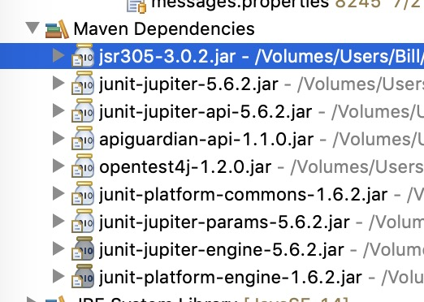

Find all KeyStrokes in one or more: JFrame, JComponent, JMenuBar, JMenu, JMenuItem, and
InputMap. Produce a report sorted by key strokes marking any duplicates. Reports maybe created as tab delimited files, .csv file that can be opened directly in a spreadsheet program, or displayed in a window using JTable. Files are encoded as UTF-8 and the .csv file is generated so that Microsoft Excel will open it correctly without using the import Wizard.

<b>Example</b>

     KeyManager.getInstance()
         .registerJFrame(frame)
         .reportTable(new Dimension(1000, 800);

<b>Build Requirements</b>
<pre>
	Java 11

	See pom.xml:
		Main code
			com.google.code.findbugs  jsr305 // javax.annotations
		Testing only
			org.junit.jupiter  junit-jupiter // JUnit 5

		Selected files required for non-test source.

		

</pre>

